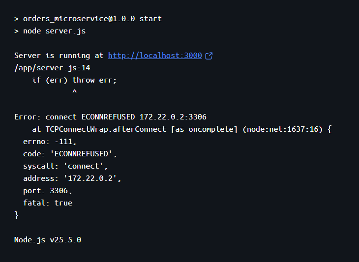
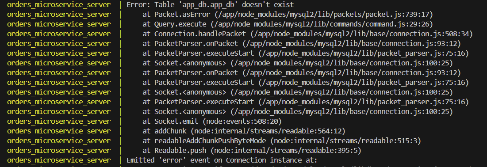
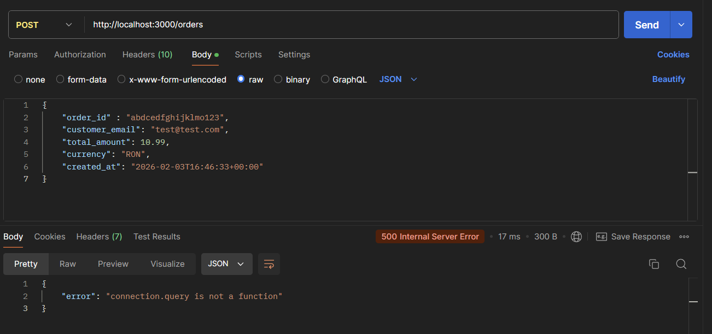

# DEBUG NOTES

## Problema 1

Imaginea de mai jos este rezultatul a doua probleme concomitente. Prima a fost faptul ca am folosit in functia de create connection
un host numit "mysql_db" pentru ca acesta era numele dat de mine containerului de mysql, insa trebuia sa folosesc "app_db" care este
numele real al bazei de date dat de mine in docker-compose.
A doua problema este faptul ca serverul porneste inaintea bazei de date, asa ca se poate rezolva fie printr-un restart al containerului
(prima solutie la indemana pe development) sau printr-un healthcheck in docker-compose.

## Problema 2

Eroarea de mai jos e cauzata de /health in care incercam sa fac selectul asta: `SELECT ${process.env.TABLE_NAME} FROM ${process.env.DB_NAME}`. Evident a fost o
eroare logica pentru ca statementul devine "Select orders from app_db" si nu are sens pentru ca app_db e numele bazei de date, nu un tabel. Am gasit aici solutii mai
clare cum sa verific existenta unui tabel ([verificare-tabel](https://five.co/blog/mysql-check-if-table-exists/))

## Problema 3

orders_microservice_server  | You have tried to call .then(), .catch(), or invoked await on the result of query that is not a promise, which is a programming error. Try calling con.promise().query(), or require('mysql2/promise') instead of 'mysql2' for a promise-compatible version of the query interface.

Problema simpla, scrie solutia chiar in eroare: nu am folosit require('mysql2/promise') ci doar 'mysql2'.

## Problema 4

Problema asta a aparut pentru ca am scris middleware care ataseaza conexiunea la request dupa ce am atasat rutele la app. Le-am inversat si a mers.

## Problema 5

Am facut un get pentru toate comenzile, dar nu returna decat prima comanda. Problema era ca in orderRepository destructuram rezultatul query-ului cu
const [rows] = await connection.query('SELECT * FROM orders') si returnam rows, iar in serviciu foloseam iar const [rows] care il
destructura din nou returnand doar primul element.
